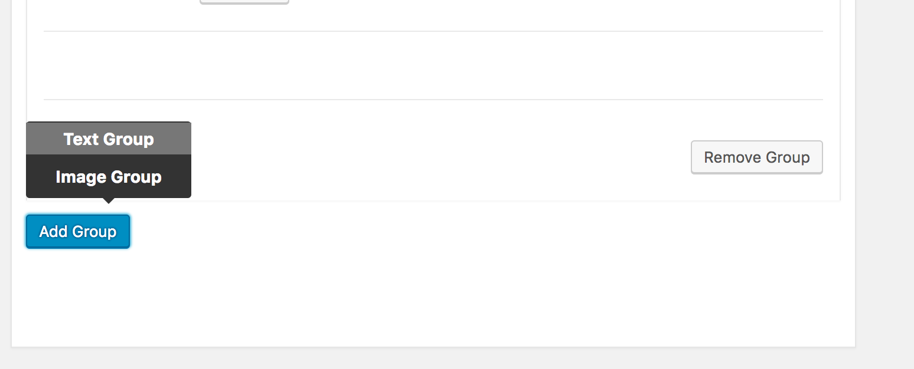

# CMB2 Flexible Field

The CMB2 Flexible Field allows the creation of group layouts, which can then be selected and switched between by a user. Each layout group contains a set of existing CMB2 fields, defined in an array in the field setup. These layout groups are then toggleable, sortable and repeatable.



The data itself is saved to the field's ID in a serialized and iterable array with the layout group ID attached.


## Adding a Flexible Field

Adding a flexible field is the same as adding any other CMB2 field. The only addition is the `layouts` option, which should contain an array of arrays, each with a separate group.

To begin, set up a standard CMB2 metabox:

```
// Basic CMB2 Metabox declaration
$cmb = new_cmb2_box( array(
	'id'           => 'prefix-metabox-id',
	'title'        => __( 'Flexible Content Test' ),
	'object_types' => array( 'post', ),
) );

Then add your flexible field definition. Each layout group should be defined in the layouts array, with the `ID` for that group as its key. Each layout group can contain a `title` and a list of CMB2 `fields`.

// Sample Flexible Field
$cmb->add_field( array(
	'name'       => __( 'Test Flexible', 'cmb2-flexible' ),
	'desc'       => __( 'field description (optional)', 'cmb2-flexible' ),
	'id'         => 'prefix_flexible',
	'type'       => 'flexible',
	'layouts' => array(
			'text' => array(
				'title' => 'Text Group',
				'fields' => array(
					array(
						'type' => 'text',
						'name' => 'Title for Text Group',
						'id' => 'title',
					),
					array(
						'type' => 'textarea',
						'name' => 'Description for Text Group',
						'id' => 'description',
					)
				),
			),
			'image' => array(
				'title' => 'Image Group',
				'fields' => array(
					array(
						'type' => 'file',
						'name' => 'Image for Image Group',
						'id' => 'title',
					),
					array(
						'type' => 'textarea',
						'name' => 'Description for Image Group',
						'id' => 'description',
					)
				),
			),
		)
) );
```

## Getting Data from a Flexible Field
Flexible fields are stored in a single meta key, and can be retrieved using the WordPress API. This will return an array of data, each with the layout key defined as `layout` and the group's data by field ID.

```
$flexible_fields = get_post_meta( $post_id, 'flexible_field_name', true );
foreach( $flexible_fields as $field ) {
    if ( 'text' === $field['layout'] ) { ?>
        <h2><?php echo esc_html( $field['title'] ); ?></h2>
        <?php echo esc_html( $field['description'] );
    }
}
```
